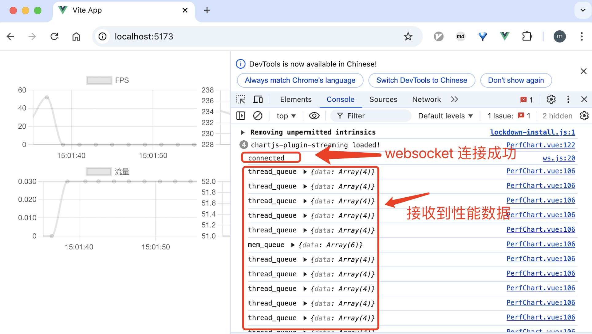

# 文档

## 整体流程

```
chart.js <- Vue.js <- Flask <- Redis <- mobileperf
```

mobileperf 既是**性能测试工具**，也是 websocket 外部数据源。

Vue.js 是 websocket 前端, Flask 是 websocket 后端。Vue.js  以 websocket 方式监听实时性能测试数据

1. mobileperf 将性能数据写入本地消息队列 Redis
2. Flask 将消息队列 Redis 中的数据推送到 Vue.js
3. Chart.js 实时绘制性能数据

## Mobileperf

具体使用说明见 [410063005/mobileperf: Android performance test](https://github.com/410063005/mobileperf)。

[410063005/mobileperf: Android performance test](https://github.com/410063005/mobileperf) fork 自 [alibaba/mobileperf: Android performance test](https://github.com/alibaba/mobileperf)

本项目在原有项目基础上的改动点见 [Comparing alibaba:master...410063005:master · alibaba/mobileperf](https://github.com/alibaba/mobileperf/compare/master...410063005:mobileperf:master)

注意：`./run.sh` 运行测试前，请确保本地 redis 已正确安装和运行。

## 后端

### Redis

```
brew install redis
redis-server
```

### Flask

```
# 创建和激活 python 虚拟环境
python -m venv .venv
source .venv/bin/activate

pip install -r requirement.txt
flask run
```

启动后开始监听 5000 端口：

```
 * Debug mode: off
WARNING: This is a development server. Do not use it in a production deployment. Use a production WSGI server instead.
 * Running on http://127.0.0.1:5000
Press CTRL+C to quit
127.0.0.1 - - [18/Nov/2024 14:57:31] "GET /socket.io/?EIO=4&transport=polling&t=obay0erq HTTP/1.1" 200 -
127.0.0.1 - - [18/Nov/2024 14:57:31] "POST /socket.io/?EIO=4&transport=polling&t=obaz70xz&sid=mDbUwzZwkYpP3kbfAAAA HTTP/1.1" 200 -
127.0.0.1 - - [18/Nov/2024 14:57:31] "GET /socket.io/?EIO=4&transport=polling&t=obaz9dtb&sid=mDbUwzZwkYpP3kbfAAAA HTTP/1.1" 200 -
127.0.0.1 - - [18/Nov/2024 14:57:31] "GET /socket.io/?EIO=4&transport=polling&t=obazvugp&sid=mDbUwzZwkYpP3kbfAAAA HTTP/1.1" 200 -
```

## 前端

### Vue_gui

```
npm install 
npm run dev
```

启动后开始监听 5173 端口：

```
> vite


  VITE v5.4.11  ready in 508 ms

  ➜  Local:   http://localhost:5173/
  ➜  Network: use --host to expose
  ➜  Vue DevTools: Open http://localhost:5173/__devtools__/ as a separate window
  ➜  Vue DevTools: Press Option(⌥)+Shift(⇧)+D in App to toggle the Vue DevTools

  ➜  press h + enter to show help
```

浏览器中打开 http://localhost:5173/

